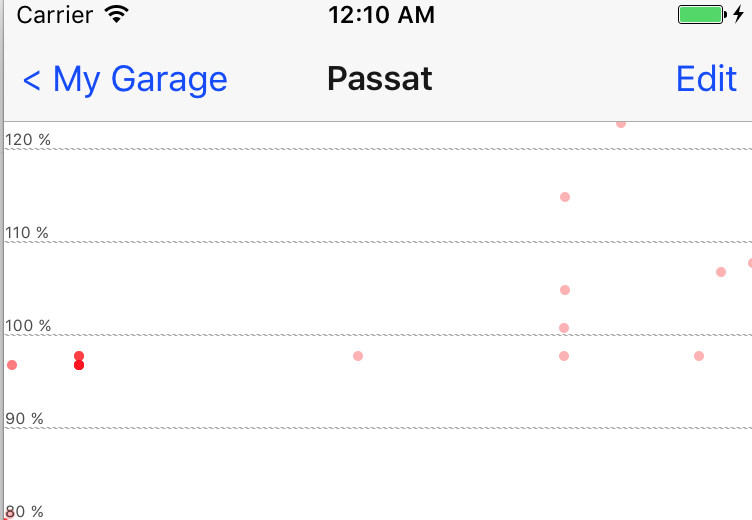

# react-native-scatter-chart
Very simple scatter chart without native dependencies



## Installation
```
npm i --save react-native-scatter-chart
```
(or)
```
yarn add react-native-scatter-chart
```

## Usage
Data format:
```javascript
const chartData = [
    {
        color: 'red',
        unit: '%',
        values: [[0,0],[1,0.5877852522924731],[2,0.9510565162951535],[3,0.9510565162951536],[4,0.5877852522924732],[5,1.2246467991473532e-16],[6,-0.587785252292473],[7,-0.9510565162951535],[8,-0.9510565162951536],[9,-0.5877852522924734],[10,-2.4492935982947064e-16],[11,0.5877852522924729],[12,0.9510565162951535],[13,0.9510565162951536],[14,0.5877852522924734],[15,3.6739403974420594e-16],[16,-0.5877852522924728],[17,-0.9510565162951534],[18,-0.9510565162951538],[19,-0.5877852522924735]]
    },
    {
        color: 'green',
        unit: '%',
        values: [[0,1],[1,0.8090169943749475],[2,0.30901699437494745],[3,-0.30901699437494734],[4,-0.8090169943749473],[5,-1],[6,-0.8090169943749475],[7,-0.30901699437494756],[8,0.30901699437494723],[9,0.8090169943749473],[10,1],[11,0.8090169943749476],[12,0.30901699437494773],[13,-0.3090169943749471],[14,-0.8090169943749472],[15,-1],[16,-0.8090169943749477],[17,-0.30901699437494784],[18,0.309016994374947],[19,0.8090169943749471]]

    }
];
```

Inside render:
```javascript
<ScatterChart
    backgroundColor='#ffffff'
    data={chartData}
    minY={90}
    maxY={110}
    unitY='%'
    horizontalLinesAt={[80, 90, 100, 110, 120]}
    height={200}
/>
```

## Why this module?
Wanted to display a simple scatter chart in my React Native app and existing modules depended on multiple modules and always needed native components.

## How does it work?
This component draws the chart using only `<View />` and `<Text />` react native components.

## Accepted props
```javascript
const propTypes = {
    data: PropTypes.arrayOf(PropTypes.arrayOf(PropTypes.shape({
        x: PropTypes.number,
        y: PropTypes.number
    }))), // takes array of series of data (array of arrays of {x, y})
    chartWidth: PropTypes.number, // by default uses entire width of the device
    chartHeight: PropTypes.number, // by default 200 scaled px
    backgroundColor: PropTypes.string, // 'white' by default
    colors: PropTypes.arrayOf(PropTypes.string), // specify the colors for each series of data
    minY: PropTypes.number,
    maxY: PropTypes.number,
    minX: PropTypes.number,
    maxX: PropTypes.number,
    unitX: PropTypes.string,
    unitY: PropTypes.string,
    horizontalLinesAt: PropTypes.arrayOf(PropTypes.number),
    verticalLinesAt: PropTypes.arrayOf(PropTypes.number),
}
const defaultProps = {
    chartHeight: 200,
    chartWidth: Dimensions.get('window').width,
    backgroundColor: 'white'
}
```
